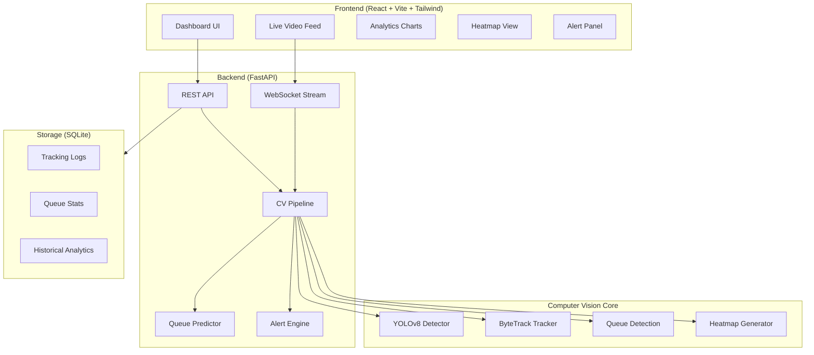

# AI-Powered Queue Management System — Implementation Plan

## Overview

Build a real-time intelligent queue analytics system using Computer Vision (YOLOv8 + ByteTrack) with a FastAPI backend, React frontend dashboard, and SQLite database for lightweight local deployment.

---

## User Review Required

> [!IMPORTANT]
> **Database Choice**: The spec mentions PostgreSQL or MongoDB. I recommend **SQLite** for easy local setup (zero configuration). If you want PostgreSQL, I'll add Docker Compose for the database. Please confirm.

> [!IMPORTANT]
> **Tailwind Version**: You requested Tailwind — I'll use **Tailwind CSS v3** via CDN for simplicity. Let me know if you prefer v4 or a different setup.

> [!IMPORTANT]
> **Video Source**: The system will support both webcam and uploaded video files. I'll include a sample video download script. Does that work?

> [!WARNING]
> **GPU Requirement**: YOLOv8 runs on CPU by default. GPU (CUDA) dramatically improves FPS. The code auto-detects GPU but works on CPU too (expect ~5-8 FPS on CPU vs 30+ on GPU).

---

## Architecture



---

## Proposed Changes

### Backend — Python/FastAPI

#### [NEW] `backend/requirements.txt`
All Python dependencies: `fastapi`, `uvicorn`, `ultralytics`, `opencv-python`, `numpy`, `scikit-learn`, `sqlalchemy`, `aiosqlite`, `websockets`, `lap`, `pydantic`.

#### [NEW] `backend/main.py`
FastAPI application entry point with:
- CORS middleware for frontend
- WebSocket endpoint for live video streaming
- REST endpoints: `/api/analytics`, `/api/prediction`, `/api/alerts`, `/api/config`, `/api/heatmap`
- Video upload endpoint: `/api/upload-video`
- Application lifecycle (start/stop CV pipeline)

#### [NEW] `backend/config.py`
Centralized configuration:
- Queue thresholds (max length, max wait time)
- ROI definitions (configurable regions)
- YOLO model settings (confidence, model size)
- Alert thresholds

#### [NEW] `backend/database.py`
SQLAlchemy + SQLite setup:
- Tables: `tracking_logs`, `queue_stats`, `alerts_history`
- Async session management
- Data retention/cleanup utilities

#### [NEW] `backend/models/detector.py`
YOLOv8 person detector:
- Load YOLOv8n (nano) for speed, filter to person class only
- GPU auto-detection
- Batch inference support
- Returns bounding boxes + confidence scores

#### [NEW] `backend/models/tracker.py`
ByteTrack integration:
- Assign persistent IDs across frames
- Track entry/exit times per person
- Handle occlusions and re-identification
- Expose tracking history

#### [NEW] `backend/models/queue_detector.py`
Queue detection logic:
- ROI-based person filtering
- Movement speed analysis (stationary = in queue)
- Multi-queue support
- Queue membership determination using position + velocity

#### [NEW] `backend/models/predictor.py`
Queue prediction using Linear Regression:
- Features: current queue length, arrival rate, service rate
- Rolling window for time-series features
- Predict wait time for new entrants
- Auto-retrain on accumulated data

#### [NEW] `backend/utils/analytics.py`
Behavior analytics:
- Queue abandonment detection (person exits ROI before service)
- Crowd spike detection (sudden increase in count)
- Abandonment rate calculation
- Per-person and aggregate statistics

#### [NEW] `backend/utils/heatmap.py`
Heatmap generation:
- Accumulate person positions over time
- Gaussian blur for smooth density maps
- Generate heatmap image (base64 encoded for API)
- Movement flow arrows

#### [NEW] `backend/utils/alerts.py`
Smart alert system:
- Configurable thresholds
- Alert types: queue_length, wait_time, crowd_spike, abandonment
- Alert history with timestamps
- Deduplication (don't spam same alert)

#### [NEW] `backend/pipeline.py`
Main CV pipeline orchestrator:
- Connects detector → tracker → queue logic → analytics → predictor
- Frame-by-frame processing loop
- WebSocket frame broadcasting
- Runs in background thread

---

### Frontend — React + Vite + Tailwind

#### [NEW] `frontend/` (Vite project)
Initialize with `npx create-vite` using React template.

#### [NEW] `frontend/src/App.jsx`
Main application layout:
- Dark theme with glassmorphism design
- Sidebar navigation
- Dashboard grid layout
- WebSocket connection management

#### [NEW] `frontend/src/components/VideoFeed.jsx`
Live video display:
- WebSocket-connected video stream
- Bounding boxes with person IDs overlaid
- ROI visualization
- FPS counter

#### [NEW] `frontend/src/components/QueueStats.jsx`
Real-time queue statistics cards:
- Current queue count (animated counter)
- Average wait time
- Max wait time
- Predicted wait time for new entrant

#### [NEW] `frontend/src/components/Charts.jsx`
Time-series charts using Chart.js:
- Queue length over time
- Wait time trends
- Arrival/departure rates

#### [NEW] `frontend/src/components/HeatmapView.jsx`
Heatmap visualization:
- Rendered from backend heatmap image
- Auto-refreshing
- Overlay on video frame

#### [NEW] `frontend/src/components/AlertPanel.jsx`
Alert display:
- Real-time alert feed
- Alert severity levels (info, warning, critical)
- Configurable thresholds via UI

#### [NEW] `frontend/src/components/ConfigPanel.jsx`
Configuration panel:
- ROI editor (draw regions on video)
- Threshold sliders
- Video source selection (webcam/file)

---

### Utilities & Data

#### [NEW] `utils/generate_sample_video.py`
Script to generate a synthetic test video with moving people using OpenCV drawing.

#### [NEW] `data/` directory
For SQLite database file and logs.

#### [NEW] `README.md`
Complete setup instructions, architecture explanation, screenshots.

---

## Project Structure

```
CV Project Theory/
├── backend/
│   ├── main.py              # FastAPI app
│   ├── config.py             # Configuration
│   ├── database.py           # SQLite/SQLAlchemy
│   ├── pipeline.py           # CV pipeline orchestrator
│   ├── requirements.txt      # Python dependencies
│   ├── models/
│   │   ├── detector.py       # YOLOv8 person detection
│   │   ├── tracker.py        # ByteTrack tracking
│   │   ├── queue_detector.py # Queue logic
│   │   └── predictor.py      # Wait time prediction
│   └── utils/
│       ├── analytics.py      # Behavior analytics
│       ├── heatmap.py        # Heatmap generation
│       └── alerts.py         # Smart alerts
├── frontend/
│   ├── src/
│   │   ├── App.jsx
│   │   ├── App.css
│   │   ├── index.css
│   │   └── components/
│   │       ├── VideoFeed.jsx
│   │       ├── QueueStats.jsx
│   │       ├── Charts.jsx
│   │       ├── HeatmapView.jsx
│   │       ├── AlertPanel.jsx
│   │       └── ConfigPanel.jsx
│   ├── index.html
│   ├── package.json
│   └── vite.config.js
├── utils/
│   └── generate_sample_video.py
├── data/
├── Dockerfile              # (Bonus) Docker deployment
├── docker-compose.yml      # (Bonus)
└── README.md
```

---

## Open Questions

> [!IMPORTANT]
> 1. **SQLite vs PostgreSQL** — SQLite keeps it zero-dependency for local dev. Want PostgreSQL instead?
> 2. **Pre-recorded video focus** — Should I prioritize webcam live feed or uploaded video file processing? (Both will be supported, but which is primary?)
> 3. **Multi-camera** — Should I implement multi-camera support now or leave it as a future extension?

---

## Verification Plan

### Automated Tests
1. Run backend: `cd backend && pip install -r requirements.txt && python main.py` — verify API starts on port 8000
2. Run frontend: `cd frontend && npm install && npm run dev` — verify UI loads on port 5173
3. Test with sample video: Upload generated test video, verify detection + tracking works
4. Check API endpoints: `/api/analytics`, `/api/prediction`, `/api/alerts` return valid JSON

### Manual Verification
- Open dashboard in browser and verify:
  - Live video feed with bounding boxes
  - Queue statistics updating in real-time
  - Charts rendering historical data
  - Heatmap visualization
  - Alerts triggering when thresholds are exceeded
- Record browser demo of the working dashboard
